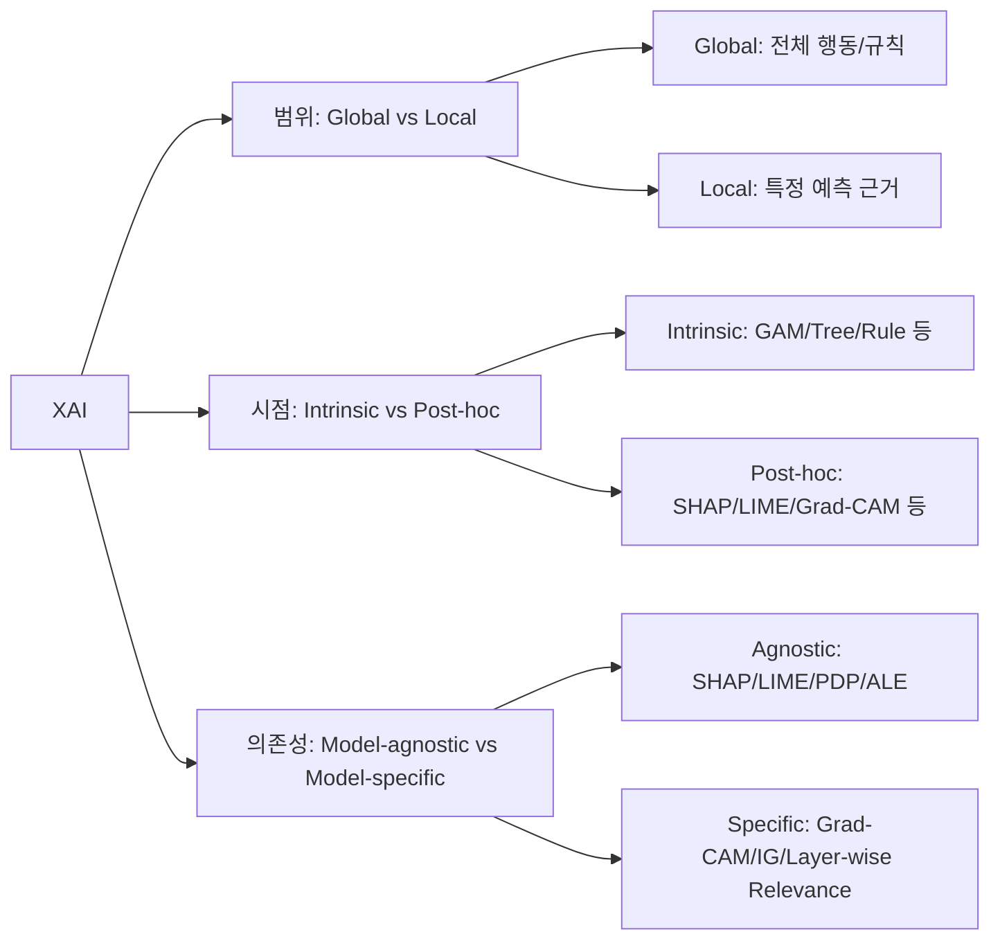

#### 1) XAI란?

* **목적:** 모델의 **의사결정 근거**를 사람이 이해 가능하게 설명.
* **왜 필요?** 신뢰·디버깅·규제 준수(감독가능성)·위험관리(스퓨리어스/데이터드리프트)·공정성 점검.
* **용어 구분**

  * *투명성(Transparency)*: 모델 구조 자체가 이해 가능(예: 선형모형, 결정트리).
  * *해석가능성(Interpretability)*: 사람 기준으로 이해 가능한 정도.
  * *설명가능성(Explainability)*: 결과에 대해 **사후(post-hoc)** 또는 **내재적(intrinsic)** 설명 제공 능력.

#### 2) 큰 분류 축

#### 3) 대표 기법 정리 (시험 포인트 ★)

####  3.1 모델-불문(Model-agnostic) — 탭·텍스트·일반

* **Feature Importance (Permuation)**

  * 아이디어: 특정 특징값을 섞어 성능 하락량 측정 → **글로벌** 중요도.
  * 장점: 간단·모델불문.
  * 주의: 상관특징 있으면 왜곡(중요도가 분산).
* **PDP(Partial Dependence Plot) / ICE(Individual Conditional Expectation) / ALE**

  * PDP: 한 변수 변화가 예측에 미치는 평균 영향(글로벌).

    * 함정: 변수 간 강한 상관관계 시 **비현실적 조합**으로 오해 가능.
  * ICE: 개별 샘플 단위 곡선(로컬 분포 파악).
  * ALE: 실제 데이터 분포 내에서 구간별 국소 기울기 → **상관관계에 더 안전**.
* **LIME(Local Interpretable Model-agnostic Explanations)**

  * 로컬 근방에 가중치 둔 **단순 대리모형**(선형/트리)으로 설명.
  * 장점: 직관·빠름.
  * 한계/함정: 근방 샘플링/커널/초모수에 **민감**, **재현성 낮을 수 있음**.
* **SHAP(SHapley Additive exPlanations)★**

  * 게임이론 샤플리값으로 각 특징의 **로컬 공헌도** 분해.
  * 핵심 성질: **지역 정확성(Local accuracy)**, **일관성(Consistency)**, **결측성(Missingness)**.
  * 장점: 이론적 견고성, 글로벌/로컬 둘 다 활용(요약 플롯, 의존 플롯).
  * 단점: 계산비용↑(대안: TreeSHAP 등 근사/전용알고리즘).

####  3.2 모델-특정(Model-specific)

* **CNN(이미지)**

  * **Saliency(Gradient)**: ∂y/∂x 절대값으로 픽셀 민감도. 빠르나 노이즈·불안정 가능.
  * **Grad-CAM★**: 마지막 conv 특성맵에 클래스별 가중치로 **열지도** 생성(어디를 봤는가).
  * **Integrated Gradients(IG)**: 기준선→입력 경로 적분으로 공헌도 누적(완화된 그래디언트 소실).
  * **SmoothGrad**: 입력 노이즈 평균으로 saliency 매끄럽게.
* **NLP**

  * **Occlusion/Erasure**: 토큰 마스킹 시 예측 변화 관찰(직관적).
  * **Gradient·LRP·IG on embeddings**: 토큰 기여도 산출.
  * **Attention 시각화**: *주의!* “attention=설명”은 항상 타당X(대안 존재/논쟁지점).
* **GNN/시계열**

  * **Subgraph/Edge 마스킹 중요도**, **Temporal saliency/occlusion** 등.

####  3.3 내재적(Interpretable by design)

* **선형/로지스틱 모형 + 정규화(L1)**: 희소성으로 해석 쉬움.
* **결정트리/규칙리스트(CORELS 등)**: 인간이 읽는 규칙.
* **GAM(Generalized Additive Models) & EBM(Explainable Boosting Machine)★**

  * $y = \beta_0 + \sum f_i(x_i) + \sum f_{ij}(x_i,x_j)$
  * 비선형성+해석력 균형. **특성별 효과 곡선**으로 설명.

####  3.4 사례 기반(Example-based)

* **프로토타입/비정형(criticisms)**: 전형적 예/비전형 예로 직관 제공.
* **최근접/영향함수(Influence Functions)**: 특정 훈련샘플이 예측에 미친 영향 추정.

####  3.5 반사실(Counterfactual)★

* “**이 예측을 바꾸려면 무엇을 최소로 바꿔야 하는가?**”

  * 요건: **근접성(작은 변화)**, **타당성(현실 가능)**, **행위가능성(사용자가 바꿀 수 있어야)**.
  * 예: 대출 거절 → “소득 +400만원, 연체 0회면 승인”.

#### 4) 평가와 검증(시험에 자주 나옴)

* **충실도(Fidelity)★:** 설명이 원모형 응답을 얼마나 잘 근사?
* **안정성/일관성(Stability):** 입력/랜덤시드 변동에 설명이 안정적인가?
* **간결성/가독성(Comprehensibility):** 사람이 이해 가능한 길이·복잡도?
* **정확성/완전성(Completeness):** 중요한 근거를 놓치지 않는가?
* **휴먼 그라운드/사용성 평가:** 사용자 실험·태스크 성능 개선 여부.
* **산니티 체크(Sanity checks):** 가중치/레이어 무작위화 시 saliency가 무의미해지는지(=민감도 존재 검증).

#### 5) 흔한 함정 & 모범 답안 포인트

* **상관특징 문제:** Permutation FI·PDP가 왜곡 → **ALE/조건부 방법** 고려.
* **분포 밖 설명(OOD):** 로컬 근방 샘플링이 현실성 떨어질 수 있음 → 데이터 기반 이웃/생성.
* **스퓨리어스 근거:** 모델이 배경/워터마크를 본 경우 → **Grad-CAM/오클루전**으로 확인, 데이터 재설계.
* **Attention=Explanation 아님:** 보조 신호로만 활용, 다른 방법과 **교차검증**.
* **액셔너블하지 않은 반사실:** 사용자가 바꿀 수 없는 변수(성별 등)는 지양.
* **과도한 복잡성:** 너무 복잡한 설명은 **의사결정 지원** 가치 떨어짐 → 요약/규칙 추출.

#### 6) 데이터 타입별 추천 조합

* **이미지(CNN):** Grad-CAM(어디를 봤는가) + IG/SmoothGrad(픽셀 기여), 필요시 **오클루전 마스크**.
* **텍스트(NLP):** 토큰 마스킹/occlusion + SHAP Text + (보조) attention 시각화.
* **표(Tabular):** Global: Permutation FI/SHAP summary, PDP·ALE.
  Local: SHAP force plot/LIME. 규제/사업설명용: **GAM/EBM** 병행.
* **시계열:** 시점별 occlusion/샤플리(윈도우), 중요한 구간 하이라이트.

#### 7) 시험에 나오는 비교 요약

* **LIME vs SHAP**

  * LIME: 로컬 대리모형, 빠름/불안정 가능, 가중 샘플링 의존.
  * SHAP: 게임이론 기반, 일관성 보장, 계산비용↑(전용가속 존재).
* **PDP vs ICE vs ALE**

  * PDP: 평균효과(상관관계 민감).
  * ICE: 개별 곡선(비선형/상호작용 관찰).
  * ALE: 분포 내 국소효과(상관관계에 강함).
* **Saliency(grad) vs Grad-CAM**

  * Saliency: 픽셀 민감도, 세밀하지만 노이즈 가능.
  * Grad-CAM: 고수준 위치 열지도, 해석 직관적.
* **Intrinsic vs Post-hoc**

  * Intrinsic: 처음부터 해석가능(트리/GAM).
  * Post-hoc: 어떤 모델에도 붙일 수 있으나 **충실도** 이슈.

#### 8) 짧은 수식/정의(필요 최소)

* **샤플리값(특징 i의 공헌도)**

  $$
  \phi_i = \sum_{S \subseteq N \setminus \{i\}} 
  \frac{|S|!(M-|S|-1)!}{M!}\big(f(S \cup \{i\}) - f(S)\big)
  $$

  * 해석: “특징 i를 **추가**했을 때 평균 마진 이득”.

#### 9) 실전 답안 템플릿(그대로 써도 되는 문장)

* **정의형:**
  “XAI는 모델 예측의 근거를 사람에게 설명하는 방법들의 총칭이며, 글로벌/로컬·내재적/사후·모델불문/모델특정 축으로 분류된다.”
* **비교형:**
  “LIME은 로컬 대리모형으로 빠르지만 안정성 이슈가 있고, SHAP은 샤플리값 기반으로 일관성 보장 대신 계산비용이 크다.”
* **그림형(이미지 문제 대응):**
  “CNN에서는 Grad-CAM으로 클래스별 주목 영역을 열지도로 확인하고, Integrated Gradients로 픽셀 단위 기여도를 안정적으로 산출한다.”
* **함정 지적형:**
  “PDP는 상관특징에서 비현실적 조합을 만들 수 있으므로, 분포를 존중하는 ALE를 병행한다.”
* **반사실 제시형:**
  “반사실 설명은 근접성·타당성·행위가능성을 만족해야 하며, 사용자에게 변경 가능한 변수만 제시해야 한다.”

#### 10) 마지막 체크리스트(30초 스캔)

* [ ] 문제 유형: 정의/비교/적용/함정 중 무엇인가?
* [ ] 글로벌 vs 로컬 구분했나?
* [ ] 선택한 기법의 **장점+한계**를 짝으로 썼나?
* [ ] 상관특징·OOD·안정성 이슈 언급했나?
* [ ] CNN/NLP/표 데이터에 맞는 예를 하나 들었나?
* [ ] 평가 지표(충실도/안정성/가독성) 한 줄 넣었나?

---

####  ✅ 예상문제 1

**문제:** XAI(Explainable AI)의 필요성과 주요 분류 기준을 설명하시오.

**모범답안:**
XAI는 AI 모델의 예측 근거를 사람에게 설명 가능하게 하는 기술로, 신뢰성 확보·규제 준수·모델 디버깅을 위해 필요하다. 주요 분류 기준은 (1) 설명 범위: 글로벌 vs 로컬, (2) 시점: 내재적(intrinsic) vs 사후(post-hoc), (3) 모델 의존성: 모델 불문(model-agnostic) vs 특정(model-specific)이다.

---

####  ✅ 예상문제 2

**문제:** LIME과 SHAP을 비교하여 설명하시오.

**모범답안:**
LIME은 로컬 근방을 샘플링 후 단순 대리모형(선형/트리)으로 설명하는 방법으로 빠르고 직관적이나, 근방 정의와 샘플링 방식에 민감하여 안정성이 낮다.
SHAP은 게임이론 기반 샤플리값으로 각 특징의 기여도를 분해하여 일관성과 지역 정확성을 보장하며, 글로벌/로컬 설명 모두 가능하다. 다만 계산 비용이 크며 전용 알고리즘(TreeSHAP 등)으로 보완한다.

---

####  ✅ 예상문제 3

**문제:** CNN 이미지 모델에서 사용되는 대표적 XAI 기법을 2가지 이상 설명하시오.

**모범답안:**
(1) Grad-CAM: 마지막 합성곱 층의 활성 맵에 클래스별 그래디언트 가중치를 적용하여 열지도로 “모델이 어디를 보았는가”를 시각화한다.
(2) Integrated Gradients: 기준선에서 입력까지의 경로 적분으로 픽셀 기여도를 계산하여 그래디언트 소실 문제를 완화한다.
이 외에 Saliency map, SmoothGrad, Occlusion 기법 등이 있다.

---

####  ✅ 예상문제 4

**문제:** PDP, ICE, ALE를 비교하여 설명하시오.

**모범답안:**
PDP는 특정 변수의 평균적 효과를 보여주는 글로벌 설명 방법이나, 변수 간 상관관계가 있으면 왜곡될 수 있다.
ICE는 개별 샘플 단위의 곡선을 그려 비선형성과 상호작용을 확인할 수 있다.
ALE는 실제 데이터 분포 내에서 국소 효과를 계산하여 상관관계 왜곡 문제를 완화한다.

---

####  ✅ 예상문제 5

**문제:** 반사실(counterfactual) 설명의 정의와 요구 조건을 제시하시오.

**모범답안:**
반사실 설명은 특정 예측을 바꾸기 위해 입력을 최소한으로 수정하는 설명 방식이다.
요구 조건은 (1) 근접성: 원래 입력과 가까워야 하며, (2) 타당성: 현실 가능한 값이어야 하고, (3) 행위가능성: 사용자가 실제로 조정할 수 있는 변수여야 한다. 예: “대출 거절 → 소득을 400만 원 이상으로 높이면 승인.”

---